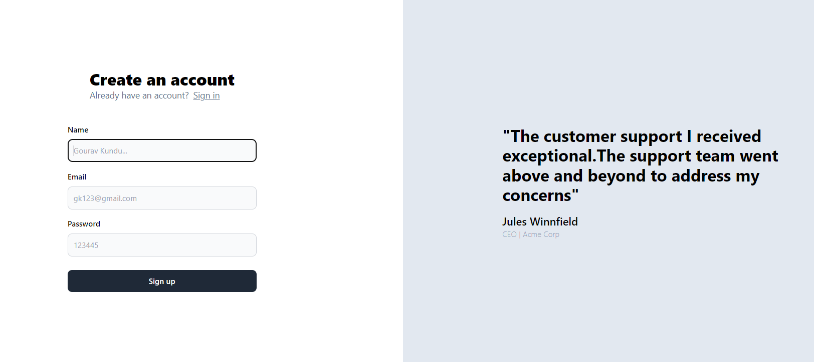
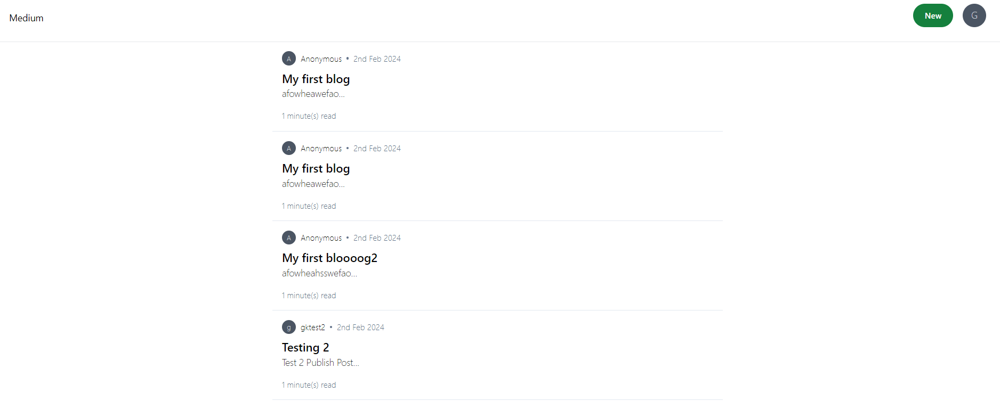
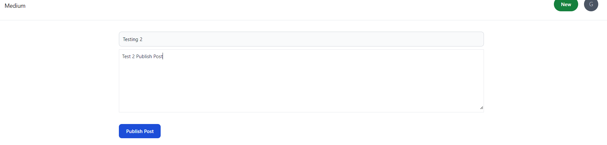
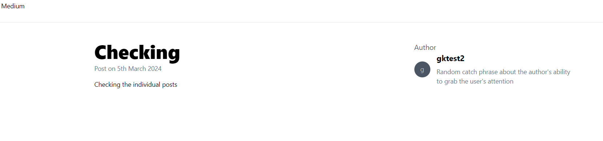

# Social Media Platform


## Introduction

- Created a Social Media Platform (Example like Redit / Medium) to interact with each other through Posts


## Features
- Can Publish a Post.
- View all Posts of all the user.
- Created a separate npm Package.
- Signup and Signin Features using jwt tokens
- Uses mysql as a database.

## Installation

After clonning the project :
```bash
cd backend
npm i
``` 
```bash
cd frontend
npm i
``` 
```bash
cd common
npm i
``` 
## Demo
- To signup, visit the [SignUp](https://social-media-2n749b9gl-gourav-devs-projects.vercel.app/signup) page for first time user.
- If you already signed up the go the [SignIn](https://social-media-2n749b9gl-gourav-devs-projects.vercel.app/signin) page.

- If you are logged in then you can visit the [Blogs](https://social-media-2n749b9gl-gourav-devs-projects.vercel.app/blogs) page.


### Login Signup Pages


### All Posts



### Publishing Posts



### Individual Post



